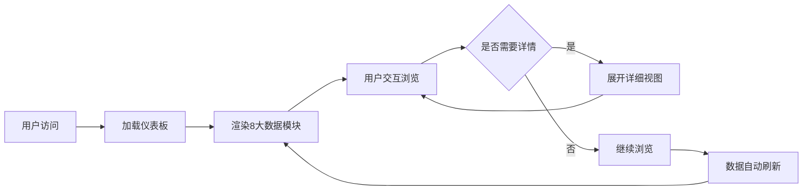

# 产品需求文档：数据监控仪表板

## 1. 产品概述
一个专业的电商/商品数据分析仪表板，用于实时监控商品销售表现、SKU排名、价格调整效果及市场趋势。面向电商运营人员和数据分析师，提供多维度的数据可视化展示和关键指标追踪。

## 2. 核心功能

### 2.1 用户角色
| 角色 | 核心权限 |
|------|----------|
| 运营人员 | 查看销售数据、监控SKU排名、分析价格调整效果、追踪市场趋势 |
| 数据分析师 | 深度分析各项指标、导出报表 |

### 2.2 功能模块
1. **主仪表板页面**：包含所有核心数据模块的聚合展示
2. **数据详情页**（可选）：各模块的详细数据视图

### 2.3 页面详情
| 页面名称 | 模块名称 | 功能描述 |
|-----------|-------------|------------------|
| 主仪表板 | 商品代码销售趋势 | 展示商品代码、销售额、销量、订单量、利润率，附带迷你趋势图 |
| 主仪表板 | SKUs排名TOP | 显示TOP10 SKU列表，包含销售额和增长率，支持查看详情链接 |
| 主仪表板 | 值量代销SKU关注 | 重点关注的SKU列表，显示销售额、销量、成本、利润率等完整指标 |
| 主仪表板 | 价格调整-SKU调价明细 | SKU价格调整记录表，包含调价前后预期销量和利润率对比 |
| 主仪表板 | 爆品排行榜 | 热门商品排名，显示销售额和占比 |
| 主仪表板 | 网站流量监控 | 各渠道流量数据统计 |
| 主仪表板 | 商品通数据 | 商品在各平台的表现数据 |
| 主仪表板 | 我的生意市场趋势 | 个人业务市场趋势跟踪，包含迷你折线图 |

## 3. 核心流程
用户打开仪表板 → 自动加载所有模块数据 → 实时展示各维度指标 → 支持点击查看详情 → 数据自动刷新

## 4. 用户界面设计
### 4.1 设计风格
- **主色调**：深蓝色系 (#1e3a5f) + 明亮强调色 (#00d4aa 绿色用于增长, #ff4757 红色用于下降)
- **按钮风格**：圆角胶囊状，微渐变背景
- **字体**：中文使用思源黑体/系统默认，数字使用等宽字体（JetBrains Mono）
- **布局风格**：卡片式网格布局，响应式设计
- **图标**：使用 lucide-react 图标库

### 4.2 页面设计概述
| 页面名称 | 模块名称 | UI元素 |
|-----------|-------------|-------------|
| 主仪表板 | 商品代码销售趋势 | 表格 + 迷你折线图 + 数值高亮 |
| 主仪表板 | SKUs排名TOP | 列表卡片 + 增长率标签 + 详情链接 |
| 主仪表板 | 值量代销SKU关注 | 完整数据表格 + 排序功能 |
| 主仪表板 | 价格调整明细 | 对比表格 + 预期值计算 |
| 主仪表板 | 多维数据面板 | 进度条 + 百分比 + 迷你图表 |

### 4.3 响应式设计
- 桌面端优先（1280px+），多列网格布局
- 平板适配（768px-1279px），2列布局
- 移动端适配（<768px），单列堆叠布局

## 5. 数据结构说明
- 所有数据使用模拟数据（Mock Data）
- 包含完整的字段定义和示例数据
- 支持动态更新和交互操作
