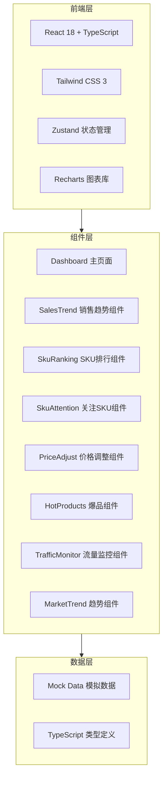

# 技术架构文档：数据监控仪表板

## 1. 架构设计



## 2. 技术描述
- **前端框架**: React@18 + TypeScript + Vite
- **样式方案**: Tailwind CSS@3
- **状态管理**: Zustand
- **图表库**: Recharts (用于迷你折线图和趋势图)
- **图标库**: lucide-react
- **初始化工具**: vite-init
- **后端**: 无（纯前端项目，使用模拟数据）

## 3. 路由定义
| 路由 | 用途 | 组件 |
|------|------|------|
| / | 主仪表板页面 | Dashboard |

## 4. 组件架构
### 4.1 核心组件清单
| 组件名称 | 文件路径 | 功能描述 |
|----------|----------|----------|
| Dashboard | src/pages/Dashboard.tsx | 主页面容器，组织所有子模块 |
| SalesTrendTable | src/components/SalesTrendTable.tsx | 商品代码销售趋势表格 |
| SkuRankingTop | src/components/SkuRankingTop.tsx | SKU排名TOP展示 |
| SkuAttentionList | src/components/SkuAttentionList.tsx | 值量代销SKU关注列表 |
| PriceAdjustmentTable | src/components/PriceAdjustmentTable.tsx | 价格调整明细表 |
| HotProductsRanking | src/components/HotProductsRanking.tsx | 爆品排行榜 |
| TrafficMonitor | src/components/TrafficMonitor.tsx | 网站流量监控 |
| ProductChannel | src/components/ProductChannel.tsx | 商品通数据 |
| MarketTrendChart | src/components/MarketTrendChart.tsx | 市场趋势图表 |
| MiniLineChart | src/components/MiniLineChart.tsx | 可复用的迷你折线图组件 |

### 4.2 数据类型定义
```typescript
// 商品销售数据
interface SalesData {
  productCode: string;      // 商品代码
  salesAmount: number;      // 销售额
  salesVolume: number;      // 销量
  orderCount: number;       // 订单量
  profitRate: number;       // 利润率 (%)
  trend: number[];          // 趋势数据点
}

// SKU排名数据
interface SkuRankItem {
  rank: number;             // 排名
  skuCode: string;          // SKU编码
  salesAmount: number;      // 销售额
  growthRate: number;       // 增长率 (%)
  detailLink?: string;      // 详情链接
}

// 价格调整数据
interface PriceAdjustment {
  skuCode: string;          // SKU编码
  currentSales: number;     // 当前销售额
  currentSalesVol: number;  // 当前销量
  currentProfitRate: number;// 当前利润率
  expectedSales: number;    // 调价后预期销量
  expectedProfitRate: number;// 调价后预期利润率
  finalProfitRate: number;  // 最终利润率
  remark: string;           // 备注
}
```

## 5. 项目结构
```
src/
├── components/            # 可复用组件
│   ├── MiniLineChart.tsx  # 迷你折线图
│   └── ...
├── pages/                 # 页面组件
│   └── Dashboard.tsx      # 主仪表板
├── data/                  # 模拟数据
│   └── mockData.ts        # Mock数据定义
├── types/                 # 类型定义
│   └── index.ts           # TypeScript类型
├── App.tsx                # 应用入口
└── main.tsx               # 渲染入口
```

## 6. 技术要点
- 使用 Recharts 的 LineChart 组件实现迷你趋势图
- Tailwind CSS 实现响应式网格布局
- Zustand 管理全局状态（如筛选条件、时间范围）
- 所有数值使用千分位格式化
- 增长率根据正负值显示不同颜色（绿涨红跌）
